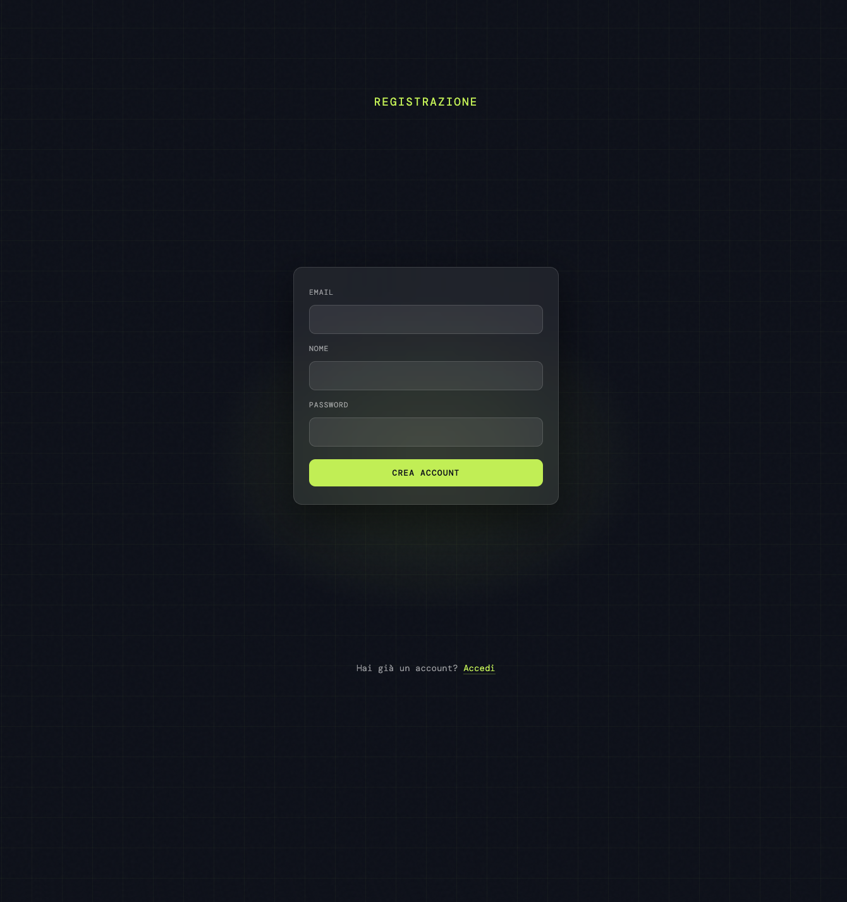
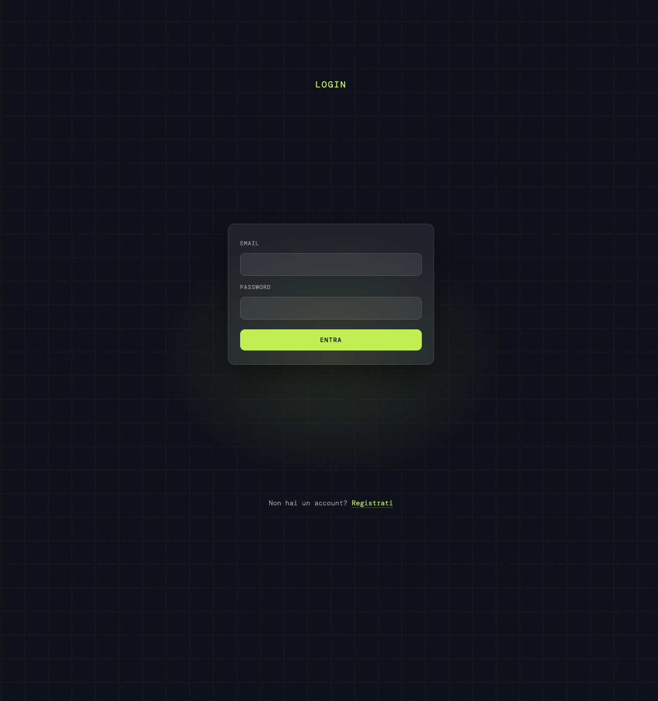
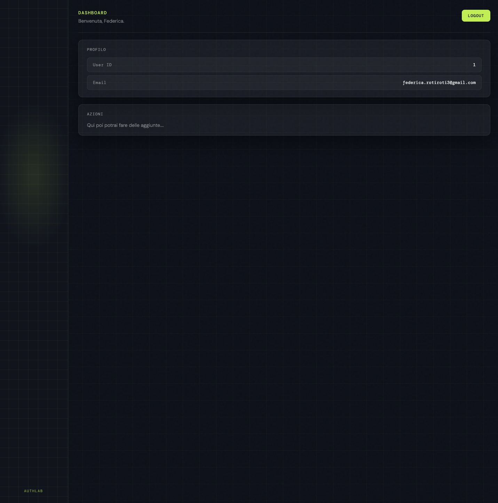

# AuthLab

Sistema di autenticazione sviluppato in PHP e MySQL, con gestione sicura delle sessioni, validazione lato server e struttura modulare riutilizzabile.

---

## Funzionalità

- Registrazione utente con validazione
- Login con verifica password (`password_hash` / `password_verify`)
- Gestione sessione sicura
- Rigenerazione Session ID
- Flash message temporanei
- Dashboard protetta
- Logout sicuro

---

## Struttura del progetto

Il progetto è organizzato in due aree principali:

- **app/** → logica applicativa e componenti backend:
  - `bootstrap.php` inizializza l'applicazione
  - `auth.php` gestisce autenticazione e protezione delle rotte
  - `db.php` crea la connessione PDO
  - `helpers.php` contiene funzioni di utilità (escape, flash)
  - `config.example.php` esempio di configurazione locale

- **public/** → pagine accessibili dal browser:
  - `register.php`, `login.php`, `dashboard.php`, `logout.php`, `index.php`
  - cartella `assets/` per CSS

---

## Stack tecnologico

- PHP 8 (PDO)
- MySQL
- CSS — glassmorphism + background CSS puro (griglia, glow radiale, noise overlay)
- Architettura modulare
- Validazione server-side

---

## Screenshot

### Registrazione


### Login


### Dashboard


---

## Installazione

1. Clona il repository
2. Crea un database MySQL
3. Copia `config.example.php` in `config.php` e inserisci le tue credenziali:
```
   app/config.php
```
4. Avvia il server locale:
```
   php -S 127.0.0.1:8000 -t public
```
5. Apri nel browser: `http://127.0.0.1:8000`

---

## Sicurezza implementata

- Prepared statements (PDO)
- Password hash con algoritmo sicuro
- Verifica password con `password_verify`
- Rigenerazione ID di sessione dopo il login
- Protezione pagine tramite middleware (`require_auth`)

---

## Obiettivo del progetto

Costruito per dimostrare comprensione concreta di:

- Flusso HTTP (GET/POST)
- Gestione sessioni
- Strutturazione del codice backend
- Separazione tra logica, configurazione e presentazione
- Buone pratiche di sicurezza