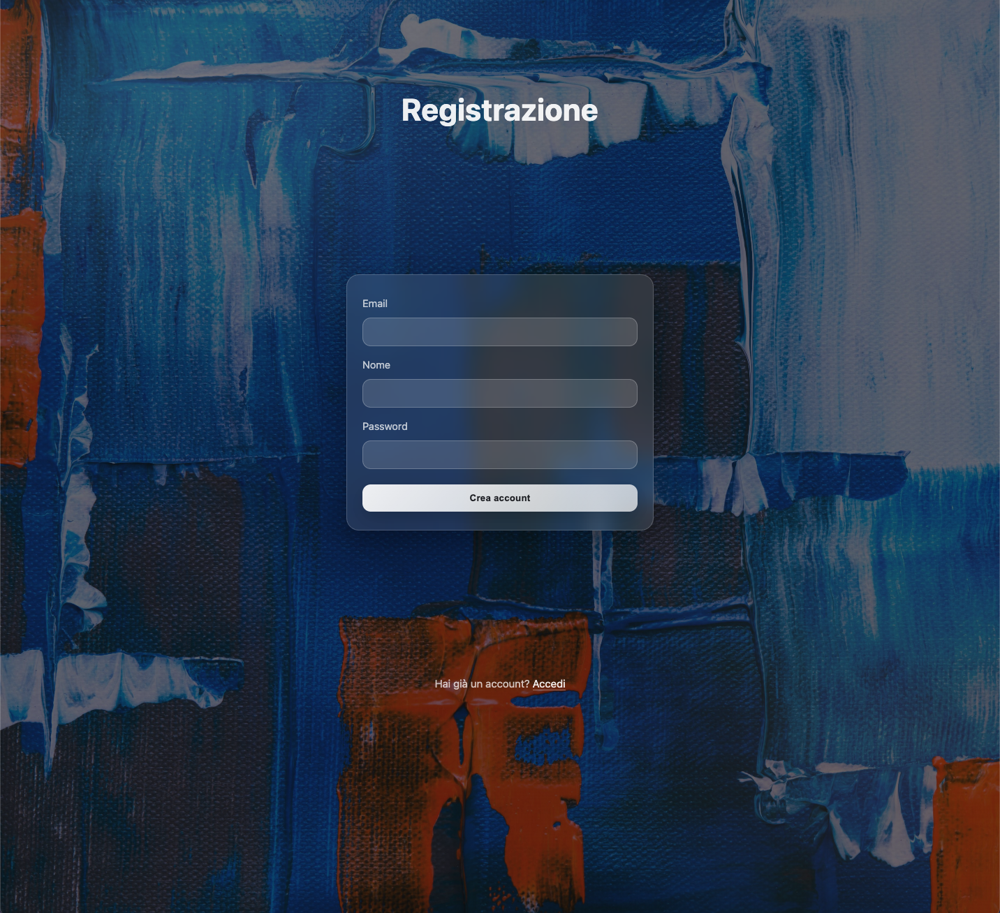
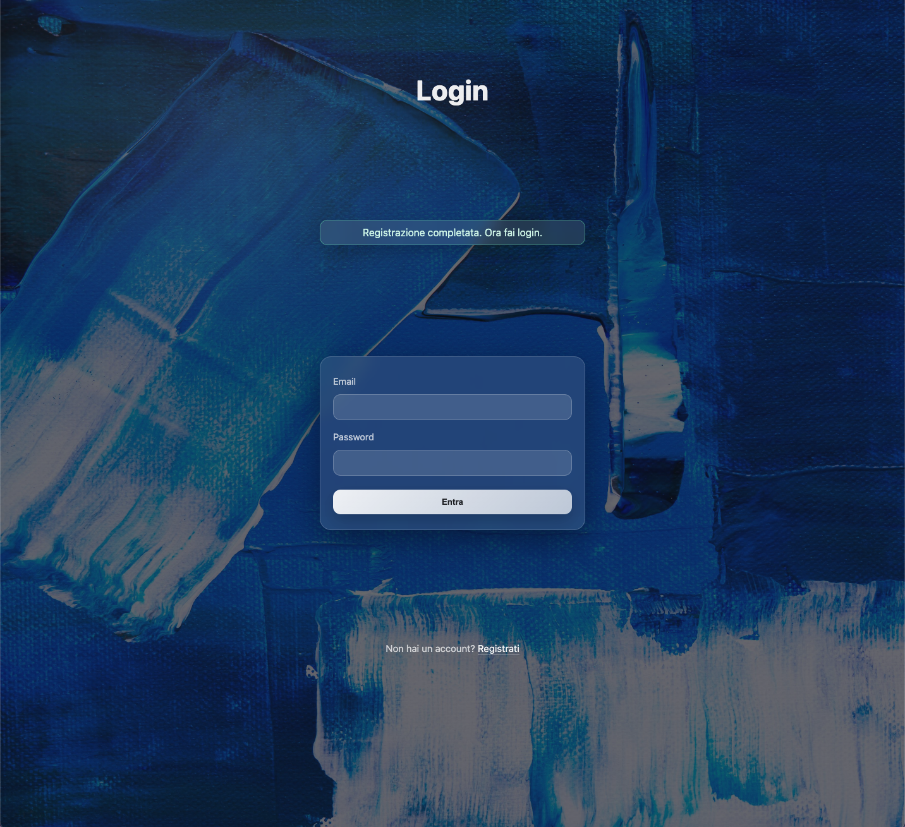
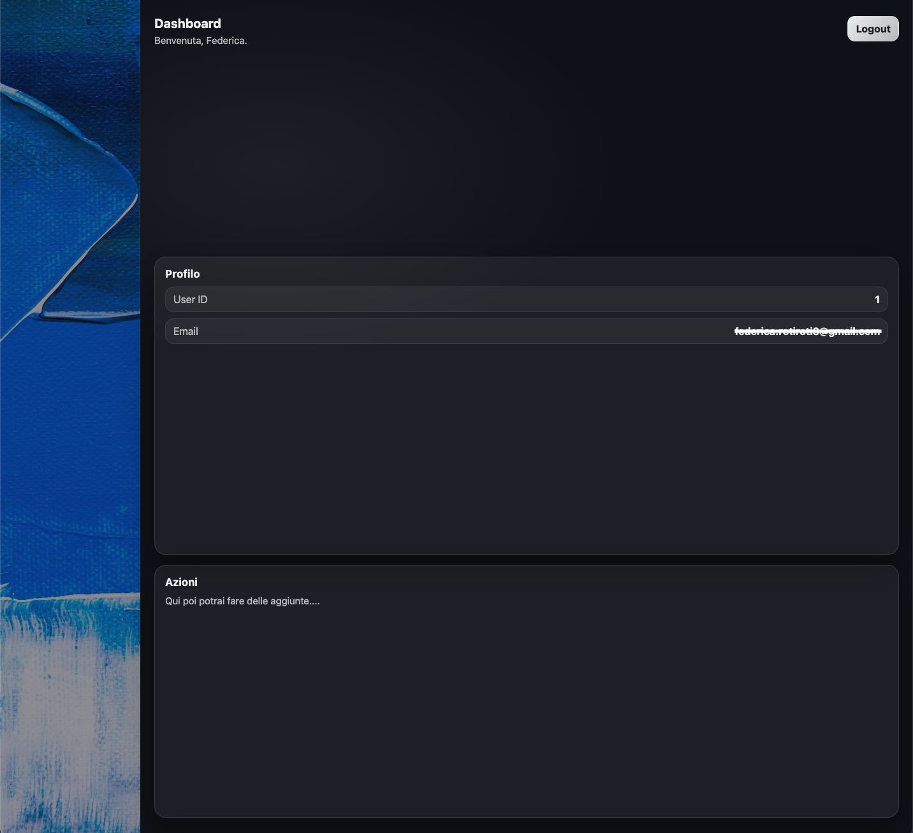

# AuthLab
Sistema di autentificazione sviluppato in PHP e MySQL, con gestione sicura delle sessioni, validazione lato server e struttura modulare riutilizzabile.
---

## Funzionalità

- Registrazione utente con validazione
- Login con verifica password (`password_hash` / `password_verify`)
- Gestione sessione sicura
- Rigenerazione Session ID
- Flash message temporanei
- Dashboard protetta
- Logout sicuro
---

## Struttura del progetto

Il progetto è organizzato in due aree principali:

- **app/** → contiene la logica applicativa e i componenti backend:
  - `bootstrap.php` inizializza l’applicazione
  - `auth.php` gestisce autenticazione e protezione delle rotte
  - `db.php` crea la connessione PDO
  - `helpers.php` contiene funzioni di utilità (escape, flash)
  - `config.example.php` esempio di configurazione locale

- **public/** → contiene le pagine accessibili dal browser:
  - `register.php`
  - `login.php`
  - `dashboard.php`
  - `logout.php`
  - `index.php`
  - cartella `assets/` per CSS e immagini
---

## Stack Tecnologico 

- PHP (PDO)
- MySQL
- Architettura modulare
- CSS moderno (Glass UI)
- Validazione server-side
---

## Screeenshot

### Registrazione

### Login

### Dashboard

---

## Installazione

1. Clona il repository
2. Crea un Database MySQL
3. Copia `config.example.php` in `config.php` e inserisci le tue credenziali: 
    
    app/config.php

4. Avvia il server locale

    php -S 127.0.0.1:8000 -t public

5. Apri nel browser:

    http://127.0.0.1:8000

--- 

## Sicurezza implementata

- Prepared statments (PDO)
- Password hash con algoritmo sicuro 
- Verifica password con `password_verify`
- Rigenerazione ID di sessione dopo il login 
- Protezione pagine tramite middleware (`require_auth`)
---

## Obiettivo del progetto

Questo progetto è stato realizzato per dimostrare:

- Comprensione del flusso HTPP (GET/POST)
- Gestione sessioni
- Struttuazione codice backend
- Separazione tra logica, configurazione e presentazione
- Buone pratiche di sicurezza
---

## Autrice

Federica Rotiroti
Junior Web Developer

